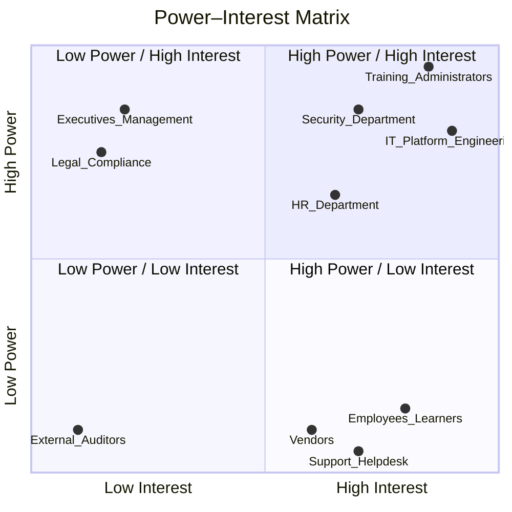

# Homework 1 – Learning Management System (LMS)

## 1. Business Drivers, Goals, Objectives, and Values

### 1.1 Business Drivers
- Need for a centralized platform for internal, workshop, security, and vendor courses.
- Compliance with regulatory and security training requirements.
- Reduction of manual administrative effort through automation.
- Standardized reporting across HR, management, and vendors.
- Improved collaboration with external training suppliers.
- Consistent user experience enabled via SSO.

### 1.2 Business Goals
- Provide a unified, easy-to-use learning system for employees and vendors.
- Improve compliance and accuracy of training processes.
- Reduce delays by automating validation and approval workflows.
- Support decision-making via detailed reporting and analytics.
- Ensure scalable integration with third-party training providers.

### 1.3 Business Objectives (SMART)
- Reduce manual course management workload by 40% within 12 months.
- Achieve 95% accuracy in automated course validation rules.
- Maintain 99% system availability.
- Enable users to find and book courses in under 2 minutes.
- Reduce vendor onboarding time from weeks to days.
- Trigger notifications (email/SMS) within 30 seconds of workflow events.

### 1.4 Business Values
- Transparency in course offerings and booking processes.
- Improved regulatory and security compliance.
- Higher employee productivity due to streamlined workflows.
- Cost savings through automation and reduced manual tasks.
- Better vendor experience and faster opportunity publishing.
- Data-driven insights through reporting and auditing.

---

## 2. Stakeholders Identification

| Stakeholder Group | Role / Interest | Responsibilities | Required Views / Documents |
|-------------------|------------------|------------------|-----------------------------|
| Employees / Learners | Book and attend courses | Search, booking | UI mockups, user flows |
| HR Department | Ensures compliance and training coverage | Manage reports, track training | Dashboards, compliance rules |
| Training Administrators | Manage courses and approvals | Create/update courses, validation | Workflow diagrams, admin UI |
| Security Department | Oversees access and security training | SSO, permissions, compliance | RBAC models, data protection docs |
| IT / Platform Engineering | Maintains system infrastructure | Integrations, uptime, SSO | Architecture diagrams, API specs |
| Third-Party Vendors | Provide external courses | Create/update opportunities | Vendor UI, API documentation |
| Executives / Management | Monitor KPIs and ROI | Review reports, strategy | KPI dashboards |
| Legal / Compliance | Ensures regulatory adherence | Review data flows | Data retention docs |
| Support / Helpdesk | Assist users | Troubleshooting | Support guidelines |

---

## 3. Power–Interest Matrix

---

## 4. RACI Matrix

| Activity / Capability | HR | Admin | IT | Security | Vendors | Management | Support | Learners |
|------------------------|-----|--------|-----|----------|-----------|--------------|----------|-----------|
| Course creation/update | C | **R/A** | C | C | I | I | I | I |
| Priority assignment | C | **R/A** | I | C | I | I | I | I |
| Course revalidation | C | R | C | **A** | I | I | I | I |
| Booking request creation | C | I | I | I | I | I | I | **R** |
| Booking validation | C | **R/A** | I | C | I | I | I | I |
| Approval workflow | C | **R/A** | I | C | I | I | I | I |
| Notifications (SMS/Email) | I | C | **R** | C | I | I | I | I |
| Vendor course management | I | C | I | I | **R/A** | I | I | I |
| Search functionality | I | C | R | C | I | I | I | **A** |
| Reporting | **A** | R | C | C | I | C | I | I |
| SSO & security | I | I | **R** | **A** | I | I | I | I |
| Infrastructure & uptime | I | I | **R/A** | C | I | I | I | I |
| User support | I | I | C | I | I | I | **R/A** | C |

Legend:  
- **R = Responsible**  
- **A = Accountable**  
- **C = Consulted**  
- **I = Informed**

---

