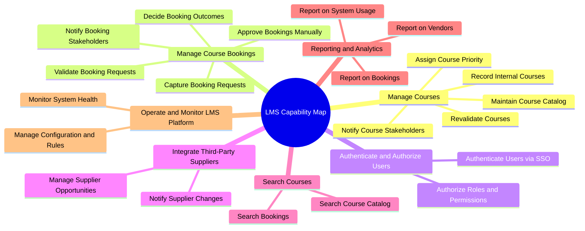
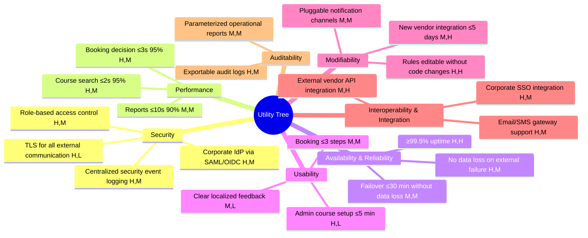

# Homework 2 — Capability Map, Utility Tree, ASR, Constraints  
Learning Management System (LMS)

This document defines the capability map, utility tree, architecturally significant requirements (ASR), quality attribute requirements, and constraints for the Learning Management System.

---

# 1. Capability Map

---

# 2. Utility Tree

Legend: (Importance, Difficulty/Risk) — H/M/L  
Each scenario represents a **quality attribute** that is relevant to architectural decisions.

## 2.1 Utility Tree

---

# 3. Architecturally Significant Requirements (ASRs), QA Requirements, and Constraints

ASRs are the subset of requirements that **directly influence architecture**.  
They are distinct from technical requirements (behavioral) and constraints (limitations).

---

# 3.1 Architecturally Significant Requirements (ASR)

| ID | Category | ASR | Rationale |
|----|----------|-----|-----------|
| **ASR-SEC-01** | Security | The LMS must delegate all authentication to the corporate identity provider using SAML/OIDC; no local credential storage allowed. | Drives choice of authentication mechanism, security architecture, libraries, and integration model. |
| **ASR-SEC-02** | Security | All external system communication must use TLS with strong cipher suites. | Determines API gateway configuration, certificate management, service endpoints. |
| **ASR-SEC-03** | Security | LMS must implement centralized, immutable audit logging for admin, vendor and booking operations. | Requires logging architecture, audit storage design, and compliance alignment. |
| **ASR-PERF-01** | Performance | Course search must support ≤2s response time for 95% of requests, requiring indexing and/or caching mechanisms. | Influences DB choice, indexing strategy, caching tier, or search engine use. |
| **ASR-PERF-02** | Performance | Booking validation must complete within ≤3s under normal load using efficient rule evaluation. | Drives rule engine architecture, synchronous/async design. |
| **ASR-AVAIL-01** | Availability | LMS must maintain ≥99.5% availability, requiring redundancy, failover, and monitoring strategies. | Influences deployment topology, clustering, health checks. |
| **ASR-MOD-01** | Modifiability | Business validation rules must be externally configurable without code changes (rule engine or config-driven approach). | Determines modularity, configuration architecture, extensibility. |
| **ASR-INTEG-01** | Integration | LMS must integrate with at least one external vendor API using standardized integration patterns. | Influences integration layer design, error handling, API gateway. |

---

# 3.2 Quality Attribute Requirements (Non-ASR Technical Requirements)

| ID | Quality Attribute | Requirement |
|----|-------------------|-------------|
| **QA-SEC-01** | Security | Only authenticated users may access LMS functionality. |
| **QA-SEC-02** | Security | Security events must be timestamped and logged. |
| **QA-PERF-01** | Performance | Report generation must complete within ≤10 seconds for standard periods. |
| **QA-USAB-01** | Usability | Admin must configure or update a course in ≤5 minutes. |
| **QA-USAB-02** | Usability | Booking process must consist of ≤3 steps. |
| **QA-INTEG-01** | Interoperability | LMS must support multiple notification channels (email, SMS). |
| **QA-REP-01** | Auditability | Audit logs must be exportable in CSV or similar format. |

---

# 3.3 Constraints (True Architectural Limitations)

Constraints define what **cannot** be changed and limit architectural freedom.

| ID | Type | Constraint | Source |
|----|------|------------|--------|
| **CON-ORG-01** | Organizational | LMS must use the existing corporate SSO provider; replacing or modifying IdP is not allowed. | IT/Security |
| **CON-ORG-02** | Organizational | LMS must comply with corporate audit and logging retention policies. | Compliance |
| **CON-TECH-01** | Technical | LMS must be deployed within corporate infrastructure (on-prem/cloud as defined). | Enterprise Architecture |
| **CON-TECH-02** | Technical | Only standard SSO and security protocols (SAML/OIDC, TLS) may be used. | Security Architecture |
| **CON-TECH-03** | Technical | Vendor-side APIs cannot be modified; LMS must adapt to existing vendor interfaces. | Vendor |
| **CON-OPS-01** | Operational | Monitoring and logging must integrate with existing ops tools and processes. | DevOps |

---
