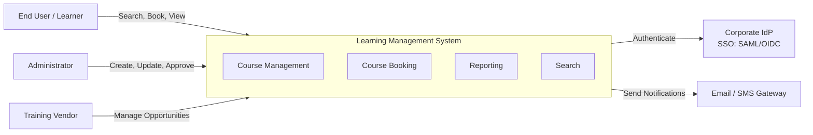
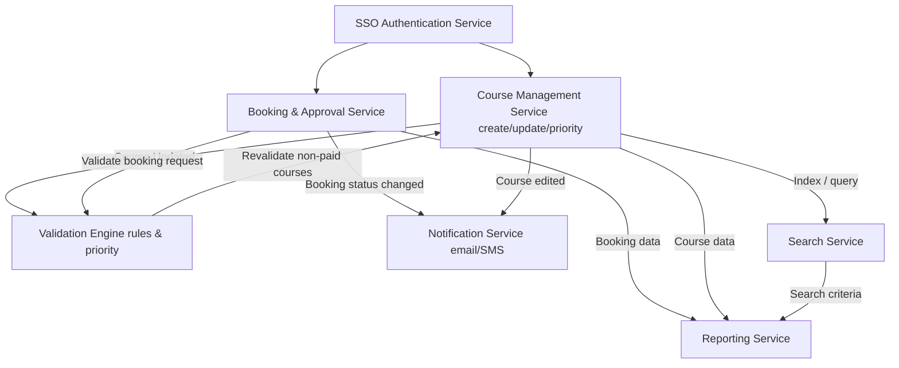

# LMS — Architectural Views (3 Views)

> **Case:** Learning Management System (LMS) for internal courses, workshop recordings, security courses, and vendor courses.  
> **Deliverable:** 3 different views relevant to architectural design, with view briefs + legends.  
> **Notation:** Informal + Mermaid (GitHub-ready) and BPMN-like flow (Mermaid).

---

## 1) Context View — System Context

### View brief
This view defines the **system boundary** of the LMS and shows the **primary external actors** and **external systems** it interacts with.  
It helps clarify **who** uses the system and **which integrations** are required, without implementation details.

### Diagram legend
- **Actor** — external user role (human)
- **External System** — outside the LMS boundary
- **LMS** — target system boundary
- **Arrow (→)** — primary interaction direction

### Diagram (Mermaid)

